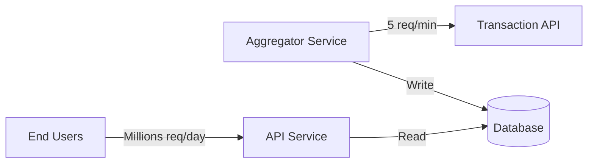
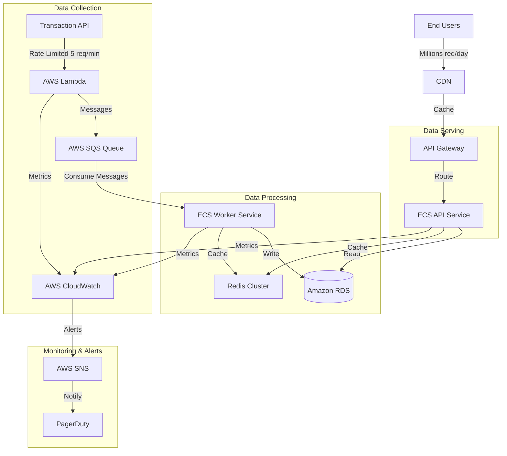

## Focus on

- Integrate all the services in a reliable way first
- Focus on correctness and data consistency later

## Solution Architecture

## Decisions

- Create a mock transaction-api using Faker, OpenAPI and rate limiting
- Use nest CLI to bootstrap the transaction-aggregator
- NPM for simplicity
- Use TypeORM and Sqlite for simplicity
- Generate interfaces from OpenAPI spec using `openapi-typescript-codegen`

## Ideas

- `docker-compose.yml` for local development and testing with real PostgreSQL
- Higher-quality mock data with stateful users for correctness and data consistency
- Use Redis for caching
- generate transaction-api on build and don't store generated client in the repo

### Production Architecture

