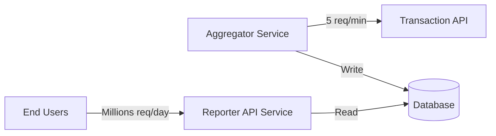
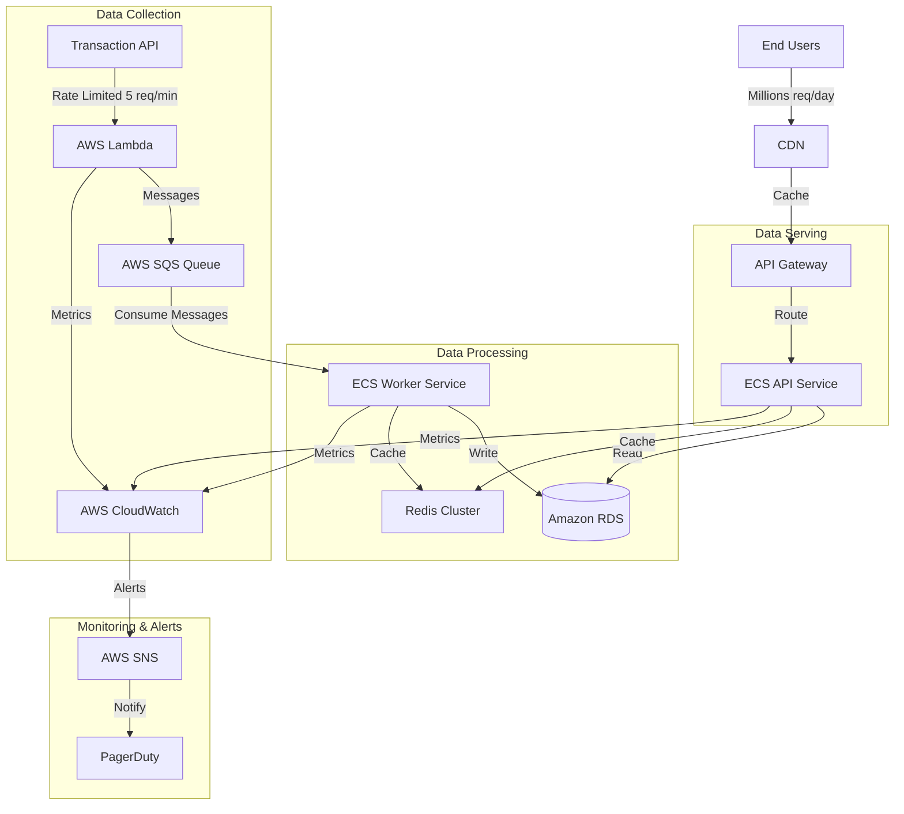

# 🥞 Transaction Aggregator System

## Table of Contents
- [Quick Start](#quick-start)
  - [Prerequisites](#prerequisites)
  - [Run Services](#run-services)
  - [Test](#test)
- [Solution Architecture](#solution-architecture)
- [Decisions](#decisions)
- [Ideas](#ideas)
  - [Production Architecture](#production-architecture)

## Quick Start

### Prerequisites
- Node.js 20+ (`brew install node`)
- Git (`brew install git`)

### Run Services

1. Clone and setup:
```bash
git clone git@github.com:yourusername/transaction-aggregation.git
cd transaction-aggregation
```

2. Start each service in separate terminals:

```bash
# Terminal 1: Transaction API
cd services/transaction-api
npm install
npm run start:dev     # Runs on :3000

# Terminal 2: Aggregator
cd services/aggregator
npm install
npm run start:dev     # Runs on :3001

# Terminal 3: Reporter
cd services/reporter
npm install
npm run start:dev     # Runs on :3002
```

### Test
```bash
# Trigger aggregation
curl -X POST http://localhost:3001/transactions/aggregate

# View results
curl http://localhost:3002/users/uuid/transactions
```

## Solution Architecture

While making everything as a single service would be more time efficient, it would not be a good design choice. The architecture should be designed to be scalable and maintainable.



## Decisions

- Integrate all the services in a reliable way first, focus on correctness and data consistency later
- Focus on making the entire system **testable**, leave tests for the end:
    - NestJS for Dependency injection(easy to mock side-effects)
    - TypeORM for ORM(easy to mock DB)
    - All services in the same repo to enable easy integration testing in CI/CD
    - All serces have predictable data contracts
    - [transaction-api](/services/transaction-api/) mock server, which replicates the real data source(as much as it is possible)
- Create a mock transaction-api using Faker, OpenAPI and rate limiting
- Use nest CLI to bootstrap the [aggregator](/services/aggregator/)
- NPM for simplicity
- Use TypeORM and Sqlite for simplicity
- Generate interfaces from OpenAPI spec using `openapi-typescript-codegen`
- Do not use NPM Workspaces for shared due to the time constrains
- Concern: 5000 * 60 * 24 = up to 7.2M records/day(might be a problem with 5 req/min)

## Ideas

- Improve logging
- `docker-compose.yml` for local development and testing with real PostgreSQL
- Higher-quality mock data with stateful users for correctness and data consistency
- Use Redis for caching
- Generate transaction-api on build and don't store generated client in the repo
- Postman collection for testing the default journey

### Production Architecture

